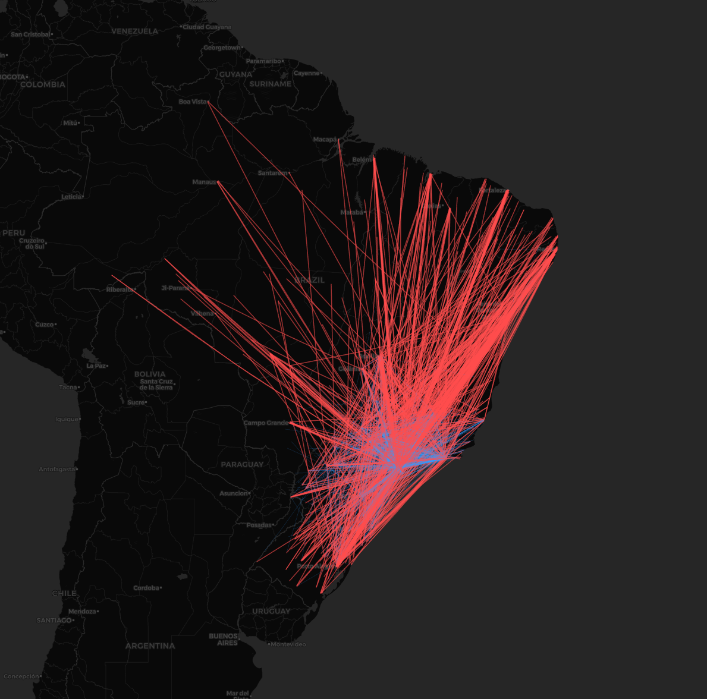

# ModuLABS_DATATON

## Project : 배송(Logistics) 지도 시각화를 통한 이커머스 마케팅 전략 수립

- 데이터 분석 결과 : 만족도 리뷰 1점의 53.3%가 배송 지연 및 미도착 문제에서 기인하였다. 이는 판매자가 통제하기 힘든 택배사 이슈가 가장 컸음.

- 단순 배송 문제인지를 확인하기 위해 브라질 지도 위 히트맵 시각화 진행

시각화 진행 방향 2가지를 임시로 세워 보았음

1. 색깔별로 도시 분포도 시각화

2. 판매자-구매자 좌표를 동시에 이용해 배송 경로 표시

여기까지 일단 1월19일 분량. 시각화는 좀 더 표현을 잘 할 수 있는 방안 고려해보기

--- 
 