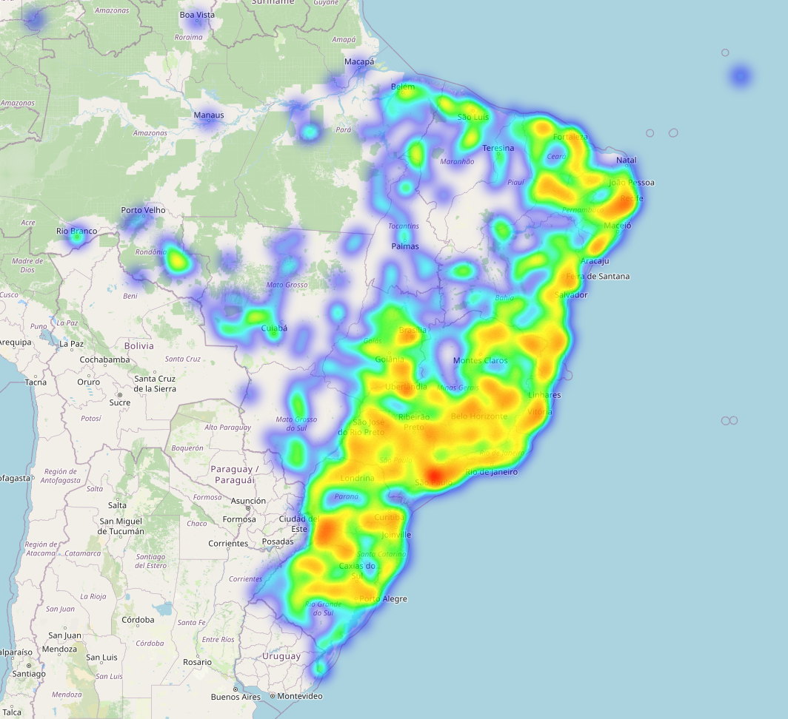
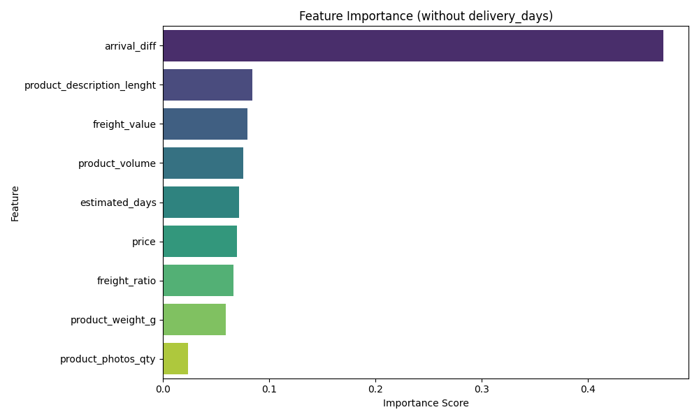
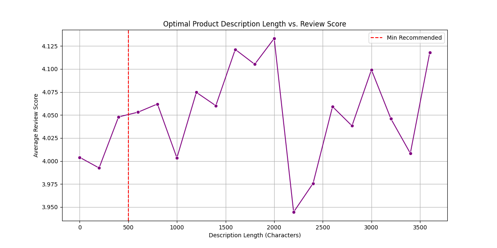
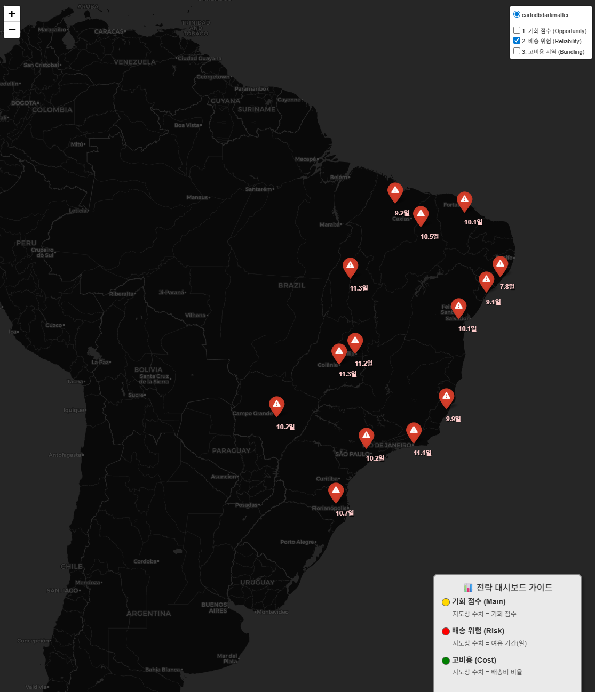

# ModuLABS_DATATON

## 1월 19일 토의 목록

- 데이터 분석 결과 : 만족도 리뷰 1점의 53.3%가 배송 지연 및 미도착 문제에서 기인하였다. 이는 판매자가 통제하기 힘든 택배사 이슈가 가장 컸음.

- 단순 배송 문제인지를 확인하기 위해 브라질 지도 위 히트맵 시각화 진행

시각화 진행 방향 2가지를 임시로 세워 보았음

1. 색깔별로 도시 분포도 시각화



2. 판매자-구매자 좌표를 동시에 이용해 배송 경로 표시


여기까지 일단 1월19일 분량. 시각화는 좀 더 표현을 잘 할 수 있는 방안 고려해보기

--- 

## 1월 20일 토의 내용

시험삼아 시각화 해본 히트맵 지도 -> 그레서 이걸로 뭘 할수 있을지 생각해보자.

> 주제 : 브라질 시장에 신규 진출하는 판매자 입장에서, 어떤 지역에서 어떤 제품을 판매하는 것이 성공할 확률이 높을까를 데이터 분석과 히트맵을 통해 결정

각자 EDA를 통해 시장 진출 시 주목해야하는 포인트를 찾아 정리하고, 회의를 통해 좀 더 집중적으로 볼 데이터를 확정한다.

### 나의 EDA

하나의 마스터 테이블로 데이터를 병합 후 간단한 전처리와 특성공학을 진행 -> 유의미하다고 생각하는 피처들로 특성 중요도 계산(랜덤포레스트 알고리즘 사용)

```python
# Feature Engineering
# (1) datetime형태로 변환 후 배송 일 편차 계산 (평균적으로 배송기간이 얼머나 걸렸나 확인)

df['order_purchase_timestamp'] = pd.to_datetime(df['order_purchase_timestamp'])
df['order_delivered_customer_date'] = pd.to_datetime(df['order_delivered_customer_date'])
df['order_estimated_delivery_date'] = pd.to_datetime(df['order_estimated_delivery_date'])

# 배송일 = 실제 배송일 - 구매일
#  df['delivery_days'] = (df['order_delivered_customer_date'] - df['order_purchase_timestamp']).dt.days

# 배송 편차 = 배송 예정일 - 실제 배송일
df['arrival_diff'] = (df['order_estimated_delivery_date'] - df['order_delivered_customer_date']).dt.days

# (2) 배송비 비율 = 배송비 / 상품 가격
df['freight_ratio'] = df['freight_value'] / df['price']

# (3) 상품 크기
df['product_volume'] = df['product_length_cm'] * df['product_height_cm'] * df['product_width_cm']

# ML 모델링을 위해 리뷰 점수가 성공적인 것과 관련이 깊은 feature 선택

features = [
    'price', 'freight_value', 'freight_ratio', 
    'arrival_diff', 
    'product_description_lenght', 'product_photos_qty', 
    'product_weight_g', 'product_volume'
]
target = 'review_score'
```

- 이 feature를 유의미하다고 생각한 기준 : 고객의 입장에서 리뷰에 영향을 끼치는 감정적인 요인을 추측 했을 때, **배송시간/가격(배송비 포함)/상품 정보의 신뢰성/배송 편의성** 이 4가지 카테고리로 분류되었음

- 특성 중요도 계산 결과 : 특성공학으로 생성된 배송 예정일과 실제 배송일간의 편차(`arrival_diff`)를 나타내는 피처가 눈에 띄게 중요한 지표로 분석되었고, 2순위로는 상품의 설명 길이로 상품에 대한 고객의 신뢰도가 중요하게 작용했음을 알 수 있었다.



- 1순위 지표인 배송편차 : 고객들은 얼마나 빠르게 도착하면 만족 / 얼만큼만 늦게 도착해도 불만족을 표현하는가?
- 2순위 지표인 상품 설명 길이 : 상품 설명을 얼만큼 쓰는게 좋은가?

- 초기 액션 플랜 설정 : 두 지표를 결합해 상품 설명에 도서산간지역 혹은 배송거리가 먼 각 지역에 따라 배송거리를 따져 상품 설명에 적절한 배송 기간을 미리 표현해놓기

데이터 분석 결과 RR(Roraima) 지역의 경우 평균 배송일은 약 46일 -> 그러나 안전 배송일(95%신뢰도)은 61일이었다.


이런 예시처럼 고객들이 이를 혼동해 배송 지연에 따른 불만족을 표시할 우려가 매우 높으니, 상품 설명 상세 페이지에 배송 과정에 대한 자세한 설명이 필요할 것으로 요구된다.

2순위 지표인 상품 설명 길이 분석 결과, 약 500~700자 정도의 상품 설명 속에 배송이 보장되는 시간을 기입하는 것이 평균 리뷰점수가 제일 가치있었다. 



너무 길이가 길면 오히려 고객들이 배송 설명을 놓치기 쉬울 염려가 있으므로, 적당한 문구 길이를 조정하는 것이 중요했다.

## 브라질 현실을 고려했을 때 

한국의 경우, 로켓배송이 평준화되어있다보니 배송시간이 1달,2달은 국내배송이어도 해외배송급으로 느껴지니 뭔가 한국인입장에서는 와닿지않는 결과였다.
그래서 브라질의 운송체계에 대한 **문화적/사회적 차이**를 조사해보았다.

우선 브라질은 땅이 매우 크다. (남한의 약 85배) -> 상파울루에서 북부지역 마나우스까지 가는 거리만 해도 포르투갈 리스본에서 러시아 모스크바까지의 거리만큼이나 멀다. 따라서 오래 걸릴 수밖에 없다.

또한 브라질 북부는 아마존이 있어 육로가 정비가 되어있지 않다면 강을타고 가야하고, 이 과정에서 막대한 시간 소비가 발생한다.

그리고 연방국가인 브라질 특성상 주마다 세금 체계가 달라 국내 배송임에도 불구하고 통관 절차를 거치는 느낌을 받는다.

상파울루와 같이 대도시의 경우에는 풀필먼트와 같은 인프라가 갖춰져서 로켓배송이 가능해졌다. 그러나 북부 지역과 같은 오지의 경우 여전히 오랜 배송 기간이 필요하다.

이러한 브라질의 현실을 고려해 액션플랜을 계획하는게 중요하다.

그렇다면 여기서 두 가지 진출방안을 고려할 수 있는데, 

1. 상파울루와 같은 대도시 : 대도시의 경우 레드오션이기 때문에 경쟁사가 많다. 따라서 그들과 차별점을 둘 수 있는 특별한 혜택이 있어야 살아남을 수 있다.

데이터 분석에 기반하면 고객은 상품 가격 대비 배송비 비율에 민감한 편이다.

따라서 배송비를 최소화하는 효율적인 플랜으로 고객이 배송비 한번 가격으로 여러 물건을 샀다고 만족도를 높일 수 있게끔 세트나 묶음 상품위주로 판매를 시도해 `freight_ratio` 만족도가 올라가고, 판매자는 객단가를 높여 경쟁사 대비 마진을 확보한다. (`payment_value`와 `review_score`의 상관관계 활용)


2. 북부 지역과 같은 오지 : 배송이 오래 걸리는 지역에서 이점을 보려면 역시 배송을 빠르게 하는게 간편하고 효과가 크다. 하지만 대도시 풀필먼트 인프라 구축같은 것은 현실적으로 어렵다. 
따라서 빠르게 할 수 없는 배송 예정일에 믿음을 주는 전략으로 가자.

고객은 배송이 지연된 것보다 예정일에 오지않은 것에 더욱 감정적으로 불만을 표시한다. (`arrival_diff` 지표 활용)

따라서 배송 보장 서비스를 밀어주고, 예정된 배송에 늦어지면 사죄의 쿠폰 보상 등으로 고객의 불만을 줄일 수 있다.

북부지역은 배송이 오래 걸리니 배송비도 매우 비싸다. `zip_code_prefix`를 기반으로 같은 우편번호를 가진 고객을 집단으로 묶어 팔레트 단위로 발송해 배송비를 절약해 현실적인 가격 경쟁력을 확보하는 프로모션을 진행할 수 도 있겠다.

+ 추가로 앞서 리우데자네이루의 경우 수요는 많은데 배송 만족도가 낮은(기회 점수 1위)지역임을 분석을 통해 알 수 있었다.

따라서 EDA를 통해 시장 전략적 요충지를 발굴하고, 해당 지역에 작게나마 인프라를 구축하는 것이다. 인프라 구축의 한계를 어느정도 보완하여 실행 할 수 있는 기회이다. 

목표를 전국 각 지역이 아닌 핵심 지역으로 고정한 것.

결론적으로 우리 팀 각자가 EDA 분석을 토대로 도출된 여러 개의 지표를 지역/상품 중심 카테고리로 분류해 각각 배점을 매기고, 종합 점수가 높은 지역과 상품을 공략하는 전략을 세웠다.

내가 제시한 지표는 모두 지역 카테고리로 분류되었으며, 이에 따른 지역별 순위는 다음과 같이 종합할 수 있었다.

```
=== 1. 배송비 비율이 높은 지역 (Bundling Target) ===
   customer_state  freight_ratio
20             RO       0.593597
21             RR       0.589050
9              MA       0.551003
14             PB       0.513756
19             RN       0.512406
--------------------------------------------------
=== 2. 배송 지연 위험이 큰 지역 (Safe Promise Target) ===
   customer_state  arrival_diff
1              AL      7.841121
24             SE      9.088472
9              MA      9.110138
7              ES      9.820862
4              BA     10.061870
--------------------------------------------------
=== 3. 기회 점수가 높은 지역 (Market Entry Target) ===
   customer_state  order_id  review_score  opportunity_score
18             RJ     14468      3.807092           0.195874
25             SP     47399      4.126859           0.147781
10             MG     13110      4.086957           0.057811
4              BA      3766      3.814392           0.049576
22             RS      6265      4.054270           0.034153
```

나의 지표로만 보았을 땐 RJ(리우데자네이루)가 종합적인 1순위가 되어 해당 지역을 중심으로 전략을 세울 것 같다.

이제 다른 팀원들의 지표 세부 분석 결과와 종합해보면 어떻게 달라질지 지켜봐야 겠다.

---

## 1월 21일 

지난번에 `folium`라이브러리를 사용해 히트맵을 시각화했던 것을 활용해서 어제 분석한 지표값을 지도상에 나타내 보았다.


우선 기회점수 지표로 1위인 리우데자네이루에 일부러 가중치를 부여해 도드라지게 하였고, 다른 도시와 기회 점수를 비교할 수 있었다.



그 다음은 배송 위험 지역군을 분류해 배송편차를 비교하고,


배송비가 높아 고비용 지역으로 분류되는 것도 확인할 수 있었다.

세가지 지표를 동시에 나타내면 다음과 같다.


나의 지표로만 분석해본 결과, 기회점수로만 보았을 때는 대도시의 리우데자네이루가 베스트 결과로 뽑히지만, 북부 오지로의 진출을 고려할 경우 선택지가 여러개가 될 수 있음을 알 수 있었다.
